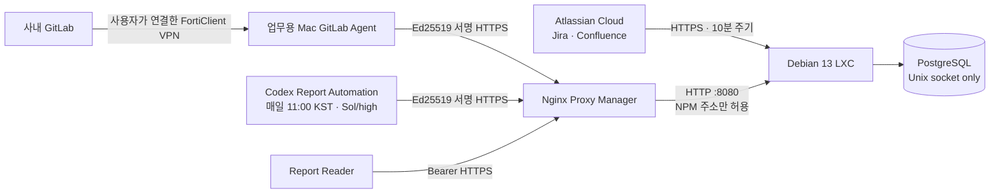

# Work History

Jira Cloud, Confluence Cloud, 사내 GitLab에 남은 **내 업무 활동만** 수집해 PostgreSQL에
정규화하고, Codex가 일간·월간 업무 보고서와 피드백을 생성할 수 있게 하는 개인용 시스템이다.

Jira와 Confluence는 Proxmox의 Debian LXC가 직접 수집한다. 사내 VPN에서만 접근되는 GitLab은
업무용 Mac의 기존 VPN 연결을 사용한다. 이 프로젝트는 FortiClient를 실행하거나 로그인·MFA·이메일
OTP를 자동화하지 않는다.

> 이 저장소가 비공개여도 회사의 Jira·Confluence·GitLab 데이터를 개인 장비로 수집·보관하는 행위는
> 별도 문제다. 설치 전에 회사 보안·개인정보·소스코드 반출 정책과 관리자의 승인을 확인해야 한다.

## 1. 시스템 개요



### 구성요소

| 구성요소 | 위치 | 역할 |
|---|---|---|
| API·DB·Atlassian 수집기 | Debian 13 LXC | 정규화, 저장, 읽기 API, GitLab 수신 API, 보고서 저장 |
| PostgreSQL | 같은 LXC | 업무 활동·문맥·체크포인트·보고서와 변경 이력 보관 |
| GitLab Agent | 업무용 macOS | VPN 연결 시 본인 GitLab 활동 수집 및 서명 전송 |
| Report Agent | Codex를 실행하는 macOS | 보고서 문맥 조회와 Markdown 업로드 |
| Nginx Proxy Manager | 별도 게스트 권장 | 공인 HTTPS 종료 후 LXC 8080으로 전달 |
| Proxmox | 내부 서버 | 비권한 LXC, 방화벽, 게스트 백업 제공 |

### 수집 대상과 제외 대상

- Jira: 본인이 생성·담당·변경·댓글·worklog에 참여한 이슈와 changelog
- Confluence: 본인이 생성·기여한 페이지 후보, 본문·버전·댓글
- GitLab: 본인 이벤트, 작성·담당·리뷰 MR/이슈, notes, discussions, approvals, commits
- 첨부파일: 바이너리는 저장하지 않고 메타데이터와 원본 링크만 저장
- 수집 불가: Confluence 페이지 열람처럼 API에 활동으로 노출되지 않는 행동
- 권한 상실·삭제된 원본: 원본 시스템에서 더 이상 조회할 수 없으면 재수집할 수 없음

## 2. 저장소 구조

```text
src/work_history/                 애플리케이션 소스
  api.py                          FastAPI 읽기·수신·보고서 API
  collectors/                    Jira·Confluence·GitLab REST 수집기
  gitlab_agent.py                macOS GitLab 수집·재개 에이전트
  report_agent.py                Codex용 서명 보고서 클라이언트
  models.py                      SQLAlchemy 데이터 모델
  reports.py                     보고서 문맥·상태·버전 처리
deploy/server/                   LXC 설치·자격증명·백업·systemd
deploy/macos/                    macOS 에이전트 설치·업데이트·LaunchAgent
deploy/npm/advanced.conf         NPM Advanced 설정
deploy/proxmox/lxc-spec.md       권장 LXC 사양과 방화벽
deploy/alembic/                  DB 마이그레이션
tests/                           수집·API·보안·보고서 테스트
```

`exports/`, `.report-tmp/`, 로컬 DB, 가상환경, 캐시와 일회성 백필 프롬프트는 의도적으로 Git에서
제외된다. 업무 보고서를 GitHub에 보관하지 않는다.

## 3. 보안 구조

### 자격증명 분리

- Atlassian API 토큰은 LXC의 `/etc/work-history/credentials/atlassian-api-token`에 `0600`으로 저장되고
  systemd `LoadCredential`로만 서비스에 전달된다.
- GitLab PAT와 GitLab 장치 개인키는 macOS Keychain의
  `com.workhistory.gitlab-agent` 서비스에 저장된다. PAT는 LXC로 전송되지 않는다.
- Report Agent 개인키는 별도 Keychain 서비스 `com.workhistory.report-agent`에 저장된다.
- GitLab 수신 장치와 Report Agent는 서버에서 목적이 다른 장치로 등록된다. 키를 서로 재사용하지 않는다.
- 읽기 API는 별도의 256비트 Bearer 토큰을 사용한다.

### 서명 요청

GitLab과 Report Agent 요청은 장치 ID, HTTP method/path, Unix timestamp, nonce, 전송 본문의
SHA-256을 Ed25519로 서명한다. 서버는 다음 요청을 거부한다.

- 등록되지 않았거나 목적이 다른 장치 키
- 서버 시간과 5분 이상 차이 나는 요청
- 이미 사용한 nonce
- 동일한 GitLab `batch_id`
- 허용 크기를 넘는 요청

DB 저장과 GitLab 체크포인트 변경은 같은 트랜잭션에서 처리한다. 서버가 batch를 승인하기 전에는
클라이언트 체크포인트가 전진하지 않는다.

### 네트워크 원칙

- PostgreSQL은 TCP로 외부에 공개하지 않고 LXC의 Unix socket만 사용한다.
- LXC 8080은 NPM 게스트 주소에서만 접근을 허용한다.
- 인터넷에는 NPM의 443만 공개한다. Proxmox 8006, PostgreSQL 5432, LXC 8080을 포트포워딩하지 않는다.
- SSH는 관리자 LAN 또는 별도의 관리 VPN에서만 허용한다. 외부 포트포워딩은 최초 설치 중에만 사용하고
  설치 확인 즉시 삭제한다.

## 4. 사전 준비

### 서버 측

- Proxmox와 Debian 13 LXC 템플릿
- Nginx Proxy Manager와 HTTPS 도메인(예: `work-history.example.com`)
- 라우터의 DHCP 예약 및 방화벽 설정 권한
- LXC에서 Atlassian Cloud, Debian 패키지 저장소, DNS, NTP로 나가는 통신

### 계정과 토큰

- Jira·Confluence에 접근 가능한 본인 Atlassian 계정과 API 토큰
- GitLab PAT: 필요한 프로젝트를 읽을 수 있는 최소 권한의 `read_api` 사용 권장
- 보고서를 읽을 클라이언트용 Bearer 토큰은 설치 중 서버가 생성

### Mac

- macOS와 Python 3.11 이상
- 업무시간 중 켜져 있고, 사용자가 필요할 때 FortiClient VPN에 직접 로그인할 수 있어야 함
- VPN 연결 상태에서 사내 GitLab URL에 브라우저 또는 `curl`로 접근 가능해야 함
- 외부의 `https://work-history.example.com`으로 HTTPS 요청 가능

## 5. Proxmox LXC 만들기

권장 사양은 다음과 같다.

- Debian 13, **비권한(unprivileged)** LXC
- 2 vCPU, RAM 4096 MiB, swap 512 MiB
- root disk 40 GiB
- `vmbr0`, 고정 생성 MAC, 최초 DHCP
- 부팅 자동 시작, NPM 게스트 다음 순서로 시작
- nesting, keyctl, FUSE, Docker 관련 기능 비활성화

생성 후 LXC의 MAC 주소를 기준으로 공유기에서 DHCP 예약을 설정한다. 이후 NPM과 방화벽은 예약된
LXC IP를 사용한다.

### 권장 방화벽

| 방향 | 허용 |
|---|---|
| LXC inbound TCP 22 | 관리자 LAN 또는 관리 VPN만 |
| LXC inbound TCP 8080 | NPM 게스트 IP만 |
| LXC inbound TCP 5432 | 허용하지 않음 |
| LXC outbound | DNS, NTP, HTTPS, 설치 중 필요한 패키지 저장소 |

## 6. SSH 공개키와 임시 포트포워딩

키는 **접속을 시작할 Mac에서** 생성한다. LXC나 원격 서버에서 생성하지 않는다.

```sh
ssh-keygen -t ed25519 -a 100 \
  -f ~/.ssh/work-history-lxc \
  -C "work-history-lxc"
ssh-add --apple-use-keychain ~/.ssh/work-history-lxc
pbcopy < ~/.ssh/work-history-lxc.pub
```

Linux 터미널에서는 `pbcopy`가 없으므로 다음으로 공개키를 출력한다.

```sh
cat ~/.ssh/work-history-lxc.pub
```

Proxmox 콘솔에서 LXC에 접속해 공개키 한 줄만 붙여 넣는다. 개인키 파일은 서버에 복사하지 않는다.

```sh
install -d -o root -g root -m 0700 /root/.ssh
nano /root/.ssh/authorized_keys
chmod 0600 /root/.ssh/authorized_keys
apt-get update
apt-get install -y openssh-server
systemctl enable --now ssh
```

내부망에서 먼저 확인한다.

```sh
ssh -i ~/.ssh/work-history-lxc root@LXC_IP
```

외부에서 설치해야 한다면 공유기에 다음과 같이 **임시** 등록한다.

```text
외부 TCP WAN_SSH_PORT → LXC_IP:22
```

접속 예시:

```sh
ssh -i ~/.ssh/work-history-lxc -p WAN_SSH_PORT root@DDNS_HOST
```

NPM은 HTTP/HTTPS 리버스 프록시이므로 일반 Proxy Host로 SSH를 전달하지 않는다. 외부 SSH를 열었다면
다음 순서로 닫는다.

1. 새 터미널에서 공개키 로그인이 성공하는지 확인한다.
2. `deploy/server/sshd-work-history.conf`를 `/etc/ssh/sshd_config.d/90-work-history.conf`로 설치한다.
3. `sshd -t` 성공 후 `systemctl reload ssh`를 실행한다.
4. 비밀번호 로그인이 거부되고 공개키 로그인이 유지되는지 다시 확인한다.
5. 공유기의 `WAN_SSH_PORT` 포트포워딩을 삭제한다.
6. Proxmox 방화벽에서 22번을 관리자 LAN/관리 VPN으로 다시 제한한다.

설정 파일은 공개키 인증을 활성화하고 비밀번호·keyboard-interactive 인증을 끄며, root는 공개키로만
접속하게 한다.

## 7. LXC 서버 설치

비공개 저장소를 LXC에 SSH로 clone할 수 있도록 GitHub deploy key 또는 본인 SSH 인증을 준비한다.

```sh
git clone git@github.com:ParkWonYeop/work-history.git
cd work-history
./deploy/server/install.sh
```

설치 스크립트는 root로 실행해야 한다. 다음 작업을 수행한다.

- PostgreSQL, Python, venv와 필수 패키지 설치
- `workhistory` 시스템 사용자·DB·DB role 생성
- 소스를 `/opt/work-history/source`로 복사하고 `/opt/work-history/venv` 설치
- `/etc/work-history` 설정·credential 디렉터리 생성
- 읽기 API 토큰 생성
- Alembic migration 적용
- API, 백업, 원본 정리 systemd unit 설치

### 서버 환경 설정

```sh
nano /etc/work-history/server.env
```

예시:

```dotenv
DATABASE_URL=postgresql+psycopg:///workhistory?host=/var/run/postgresql
ATLASSIAN_SITE_URL=https://example.atlassian.net
ATLASSIAN_EMAIL=person@example.com
PUBLIC_BASE_URL=https://work-history.example.com
DEFAULT_TIMEZONE=Asia/Seoul
RAW_RETENTION_DAYS=30
FORWARDED_ALLOW_IPS=NPM_LAN_IP
LOG_LEVEL=INFO
```

주의사항:

- `FORWARDED_ALLOW_IPS=*`를 사용하지 않는다. 실제 NPM 게스트 IP만 입력한다.
- API 토큰, PAT, 비밀번호를 `server.env`에 직접 추가하지 않는다.
- PostgreSQL URL은 Unix socket을 유지한다.

Atlassian 설정은 토큰 입력을 화면에 표시하지 않는 전용 스크립트로 수행한다.

```sh
/opt/work-history/source/deploy/server/configure-atlassian.sh
```

이 스크립트는 10분 증분 수집과 매일 14일 재검증 timer를 활성화하고 첫 동기화를 실행한다.

### 서비스 확인

```sh
systemctl status work-history-api.service --no-pager
systemctl list-timers 'work-history-*'
journalctl -u work-history-sync.service -n 100 --no-pager
```

## 8. Nginx Proxy Manager 설정

NPM에서 Proxy Host를 생성한다.

| 항목 | 값 |
|---|---|
| Domain Names | `work-history.example.com` |
| Scheme | `http` |
| Forward Hostname/IP | 예약된 LXC IP |
| Forward Port | `8080` |
| Block Common Exploits | 활성화 |
| Websockets Support | 필요 없음 |

SSL 탭에서 유효한 인증서를 선택하고 Force SSL을 활성화한다. Advanced 탭에는
`deploy/npm/advanced.conf`의 내용을 붙여 넣는다.

설정 후 외부와 내부에서 확인한다.

```sh
curl --fail --show-error https://work-history.example.com/healthz
```

502가 발생하면 NPM 컨테이너에서 `LXC_IP:8080`에 접근 가능한지, Proxmox 방화벽이 NPM IP를
정확히 허용하는지 확인한다.

## 9. Jira·Confluence 초기 수집

먼저 10분 증분 수집이 성공하는지 확인한 후 과거 데이터를 백필한다.

```sh
/opt/work-history/source/deploy/server/run-backfill.sh \
  '2026-04-01T00:00:00+09:00' \
  '2026-08-05T00:00:00+09:00'
```

날짜는 실제 입사일과 현재 시각으로 바꾼다. 백필은 7일 단위로 실행되고 source별 체크포인트를
저장하므로 중단 후 같은 명령을 다시 실행할 수 있다. 증분 수집과 백필은 같은 lock을 사용해 동시에
DB를 갱신하지 않는다.

수집 주기:

- 증분 수집: 부팅 5분 후 시작, 이후 약 10분마다
- 최근 재검증: 매일 03:30 KST, 최근 14일
- raw 원본 정리: 매일 04:10 KST
- DB 백업: 매일 02:30 KST

## 10. macOS GitLab Agent 설치

Mac에서 저장소를 clone하고 다음을 실행한다.

```sh
deploy/macos/install-agent.sh \
  'https://work-history.example.com' \
  'https://gitlab.internal.example' \
  'work-mac' \
  '2026-04-01T00:00:00+09:00'
```

설치 중 GitLab PAT를 입력한다. 설치기는 다음 위치를 사용한다.

- 설정: `~/Library/Application Support/WorkHistoryAgent/config.toml` (`0600`)
- 가상환경: `~/Library/Application Support/WorkHistoryAgent/venv`
- 로그: `~/Library/Logs/WorkHistoryAgent/`
- LaunchAgent: `~/Library/LaunchAgents/com.workhistory.gitlab-agent.plist`
- PAT·개인키: macOS Keychain

명령이 출력한 공개키를 LXC에 등록한다.

```sh
/opt/work-history/source/deploy/server/register-mac-device.sh \
  work-mac 'PRINTED_PUBLIC_KEY'
```

그다음 Mac에서 LaunchAgent를 활성화한다.

```sh
deploy/macos/enable-agent.sh
```

### 실행 방식

- LaunchAgent는 매일 09~17시 정각에 실행을 시도한다.
- 애플리케이션이 토·일요일 실행과 그날 이미 성공한 뒤의 중복 실행을 건너뛴다.
- VPN 미연결 또는 GitLab gateway 미도달이면 인증 창을 띄우지 않고 정상 종료한다.
- 실패한 날은 17시까지 매시간 다시 시도하고, 다음 평일 09시에 서버 체크포인트부터 이어간다.
- 과거 체크포인트가 48시간 이상 뒤처졌으면 한 번의 실행에서 연속 7일 창을 최대 64개 처리한다.
- 현재에 가까워지면 최근 48시간을 중첩 조회해 지연 반영·수정 데이터를 보완한다.
- 서버가 batch를 승인한 뒤에만 체크포인트가 전진하므로 VPN 중단 후 중복 없이 재개된다.

VPN 상태와 관계없이 수동으로 현재까지 따라잡으려면:

```sh
deploy/macos/run-once.sh
```

로그 확인:

```sh
launchctl print "gui/$(id -u)/com.workhistory.gitlab-agent"
tail -n 100 "$HOME/Library/Logs/WorkHistoryAgent/agent.log"
tail -n 100 "$HOME/Library/Logs/WorkHistoryAgent/agent-error.log"
```

업데이트와 PAT 교체:

```sh
deploy/macos/update-agent.sh
"$HOME/Library/Application Support/WorkHistoryAgent/venv/bin/work-history-agent" \
  --config "$HOME/Library/Application Support/WorkHistoryAgent/config.toml" \
  set-token
```

## 11. Codex Report Agent와 보고서 자동화

Mac에서 Report Agent를 설치한다.

```sh
deploy/macos/install-report-agent.sh \
  'https://work-history.example.com' \
  'codex-report-agent'
```

출력된 공개키를 LXC에 별도 목적의 장치로 등록한다.

```sh
/opt/work-history/source/deploy/server/register-report-device.sh \
  codex-report-agent 'PRINTED_PUBLIC_KEY'
```

Codex 앱에서 이 저장소를 작업 폴더로 선택하고 로컬 자동화를 만든다.

- 실행 시각: 매일 11:00 `Asia/Seoul`
- 모델: `gpt-5.6-sol`
- reasoning effort: `high`
- 실행 환경: local
- 프롬프트: `deploy/macos/report-automation-prompt.md` 전체 내용
- 알림: 실패한 실행만 알림 권장

자동화는 전날의 누락 또는 source snapshot이 변경된 `partial` 보고서를 찾아 다음 두 문서를 생성한다.

- `work_report`: 요약, 시간순 활동, 목표·행동·결과, 협업·결정, 장애, 다음 작업, 근거 링크
- `feedback`: 근거 기반 평가, 강점, 병목, 개선점, 협업, 다음 근무일 행동, 판단 한계

매월 1일에는 전월의 일간 문서를 보조 근거로 월간 업무 보고서와 피드백도 생성한다. 활동이 없는 날은
추론하지 않고 deterministic template으로 기록한다. Jira·Confluence·GitLab 중 하나라도 기간 끝까지
수집되지 않았으면 문서는 `partial`, 모두 최신이면 `final`이다.

Report Agent 업데이트:

```sh
deploy/macos/update-report-agent.sh
```

## 12. API

### 공개 상태 확인

```text
GET /healthz
```

### Bearer 인증 읽기 API

```text
GET /v1/sync-status
GET /v1/activities?from=RFC3339&to=RFC3339&sources=jira,gitlab&cursor=&limit=200
GET /v1/artifacts/{source}/{remote_id}
GET /v1/reports?cadence=daily&kind=work_report&status=final&from=YYYY-MM-DD&to=YYYY-MM-DD
GET /v1/reports/{daily|monthly}/{period}/{work_report|feedback}
```

활동 조회는 한 요청당 최대 31일, 페이지당 최대 500건이다. `next_cursor`가 null이 될 때까지 이어서
조회한다.

읽기 토큰은 LXC에서만 확인한다.

```sh
/opt/work-history/source/deploy/server/show-read-token.sh
```

토큰을 셸 기록, README, 채팅, Git에 남기지 않는다.

### GitLab 장치 서명 API

```text
GET  /v1/ingest/gitlab/checkpoint
POST /v1/ingest/gitlab/batches
```

batch는 최대 500건 또는 압축 전 약 5 MiB로 분할된다. 동일 batch 재전송은 멱등 처리되며 nonce 재사용은
인증 단계에서 거부된다.

### Report Agent 서명 API

```text
POST /v1/report-agent/context
POST /v1/report-agent/missing
PUT  /v1/reports/{daily|monthly}/{period}/{work_report|feedback}
```

일간 period는 `YYYY-MM-DD`, 월간 period는 `YYYY-MM` 형식이다.

## 13. 데이터 구조와 보존

주요 테이블:

- `source_identities`: 소스별 본인 계정 식별자
- `artifacts`, `artifact_versions`: 이슈·페이지·MR 등 업무 대상과 버전
- `activity_events`: 정규화한 활동 이벤트
- `raw_records`: 수집 당시 원본 API JSON
- `sync_runs`, `sync_cursors`: 실행 결과와 source 체크포인트
- `ingest_devices`, `ingest_nonces`, `ingest_batches`: 장치 키·재전송 방어·batch 처리
- `generated_reports`, `generated_report_versions`: 현재 보고서와 immutable revision

모든 시각은 DB에 UTC로 저장한다. 보고서와 날짜 경계는 `Asia/Seoul`로 계산한다. raw API JSON은 기본
30일 후 삭제하지만 정규화된 활동·문맥·보고서와 버전은 유지한다.

DB와 백업에는 이슈·댓글·문서 본문이 포함될 수 있으므로 디스크 암호화, Proxmox 관리자 접근 제한,
백업 저장소 암호화와 보존 정책이 필요하다.

## 14. 백업과 복원 시험

매일 생성되는 PostgreSQL custom-format backup은 `/var/backups/work-history`에 저장되며 14일간
보존된다.

```sh
ls -lh /var/backups/work-history
journalctl -u work-history-backup.service -n 100 --no-pager
```

백업만 존재하는 것으로는 충분하지 않다. 운영 DB를 건드리지 않는 별도 DB로 복원 시험을 한다.

```sh
sudo -u postgres dropdb --if-exists workhistory_restore_test
sudo -u postgres createdb --owner=workhistory workhistory_restore_test
sudo -u workhistory pg_restore \
  --dbname=workhistory_restore_test \
  /var/backups/work-history/workhistory-YYYYMMDDTHHMMSSZ.dump
sudo -u postgres psql -d workhistory_restore_test -c '\\dt'
sudo -u postgres dropdb workhistory_restore_test
```

실제 복원은 서비스를 중지하고 현재 DB 백업을 하나 더 만든 뒤 수행해야 한다. 실제 운영 DB 삭제는 이
문서의 복원 시험 명령에 포함하지 않는다. Proxmox guest backup도 별도 스토리지에 구성한다.

## 15. 업데이트

LXC에서:

```sh
cd /path/to/work-history
git pull --ff-only
./deploy/server/install.sh
systemctl status work-history-api.service --no-pager
systemctl list-timers 'work-history-*'
```

재설치는 `/opt/work-history/source`와 애플리케이션 venv를 교체하고 migration을 적용한다.
`/etc/work-history`, credential, PostgreSQL DB와 backup은 유지되지만 업데이트 전에 DB backup을 확인한다.

Mac에서 저장소를 갱신한 뒤:

```sh
deploy/macos/update-agent.sh
deploy/macos/update-report-agent.sh
```

## 16. 문제 해결

### GitLab checkpoint가 오래됨

1. Mac에서 GitLab URL이 실제로 열리는지 확인한다.
2. FortiClient는 사용자가 직접 로그인한다. OTP 자동화는 시도하지 않는다.
3. `deploy/macos/run-once.sh`를 실행하고 agent log를 확인한다.
4. 서버의 `/v1/sync-status`에서 checkpoint가 전진했는지 확인한다.

GitLab 원본 수집은 7일 창이지만 창 사이에 일주일을 기다리지 않는다. 한 번 실행하면 현재까지 연속
처리하며, 64개 창 한도를 넘는 경우 다음 실행에서 즉시 이어간다.

### Tailscale을 켜면 사내 GitLab이 열리지 않음

Tailscale subnet route나 exit node가 FortiClient의 사내 경로보다 우선할 수 있다.

```sh
route -n get gitlab.internal.example
```

충돌하는 subnet route·exit node를 끄거나 FortiClient 사용 중 Tailscale을 중지한다. 이 프로젝트는
시스템 route를 자동 변경하지 않는다.

### 서명 요청이 거부됨

- Mac과 LXC에서 NTP 동기화를 확인한다. 허용 오차는 5분이다.
- GitLab 장치와 Report 장치가 올바른 purpose로 등록됐는지 확인한다.
- 장치 ID가 config와 서버 등록값에서 같은지 확인한다.
- 개인키를 복사해 여러 장치에서 공유하지 않는다.

### 보고서가 `partial`로 남음

- 보고 기간 끝까지 세 source가 모두 수집됐는지 `/v1/sync-status`로 확인한다.
- Mac에서 GitLab catch-up을 실행한다.
- 다음 11시 자동화를 기다리거나 누락 조회 후 다시 생성한다.
- source snapshot이 바뀐 partial만 재생성되므로 이미 final인 문서는 불필요하게 덮어쓰지 않는다.

### NPM 502·504

- `work-history-api.service` 상태와 8080 listen 여부 확인
- NPM에서 LXC IP로 연결 가능한지 확인
- `FORWARDED_ALLOW_IPS`와 Proxmox 방화벽의 NPM IP 확인
- DNS와 인증서가 NPM을 가리키는지 확인
- `deploy/npm/advanced.conf`가 적용됐는지 확인

### macOS Keychain 자격증명 오류

에이전트를 root로 실행하지 않는다. 설치한 macOS 사용자와 LaunchAgent 사용자가 같아야 한다. 키를
출력하거나 파일로 내보내지 말고, PAT만 `set-token` 명령으로 교체한다.

## 17. 개발과 테스트

Python 3.11 이상이 필요하다.

```sh
python3.11 -m venv .venv
.venv/bin/pip install -e '.[dev]'
.venv/bin/pytest
.venv/bin/ruff check .
```

임시 SQLite 개발 서버:

```sh
export DATABASE_URL='sqlite+pysqlite:///./work-history.db'
export READ_API_TOKEN='development-only-token'
.venv/bin/work-history db-init
.venv/bin/work-history serve --host 127.0.0.1 --port 8080
```

개발 토큰은 운영에 사용하지 않는다. `.env`, DB, report export, Keychain 값은 Git에 추가하지 않는다.

## 18. 운영 전 최종 점검

- [ ] 회사 정책상 Jira·Confluence·GitLab 데이터의 개인 Proxmox 보관이 허용됨
- [ ] LXC는 비권한이고 불필요한 기능이 꺼져 있음
- [ ] PostgreSQL 5432가 LAN과 인터넷에서 닫혀 있음
- [ ] LXC 8080은 NPM IP에서만 접근 가능
- [ ] 외부 임시 SSH 포트포워딩이 삭제됨
- [ ] SSH 비밀번호 로그인이 비활성화됨
- [ ] NPM HTTPS와 인증서 갱신이 정상임
- [ ] GitLab PAT가 최소 권한이고 Keychain에만 존재함
- [ ] 장치별 키와 읽기 Bearer 토큰이 분리됨
- [ ] Jira·Confluence·GitLab 하루 표본을 원본 화면과 DB에서 대조함
- [ ] VPN 중단·Mac 재시작·LXC 재시작 후 checkpoint 재개를 검증함
- [ ] 중복 batch·잘못된 서명·nonce 재사용·만료 timestamp가 거부됨
- [ ] 매일 backup이 생성되고 별도 DB 복원 시험을 통과함
- [ ] 업무 보고서와 export가 Git 저장소에 포함되지 않음
